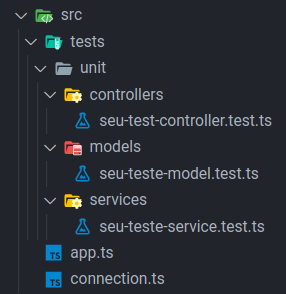

# Boas-vindas ao repositório do projeto Car Shop!

Para realizar o projeto, atente-se a cada passo descrito a seguir, e se tiver qualquer dúvida, nos envie por _Slack_! #vqv 🚀

Aqui você vai encontrar os detalhes de como estruturar o desenvolvimento do seu projeto a partir deste repositório, utilizando uma branch específica e um _Pull Request_ para colocar seus códigos.

## Termos e acordos

Ao iniciar este projeto, você concorda com as diretrizes do Código de Conduta e do Manual da Pessoa Estudante da Trybe.

# Entregáveis

<details>
  <summary>
    <strong>🤷🏽‍♀️ Como entregar</strong>
  </summary><br>

  Para entregar o seu projeto você deverá criar um *Pull Request* neste repositório.

  > Lembre-se que você pode consultar nosso conteúdo sobre [Git & GitHub](https://app.betrybe.com/course/4d67f5b4-34a6-489f-a205-b6c7dc50fc16/) e nosso [Blog - Git & GitHub](https://blog.betrybe.com/tecnologia/git-e-github/) sempre que precisar!
</details>

<details>
  <summary>
    <strong>👨‍💻 O que deverá ser desenvolvido</strong>
  </summary><br>

  Para este projeto, você deverá aplicar os princípios de Programação Orientada a Objetos (`POO`) para a construção de uma API com `CRUD` para gerenciar uma concessionária de veículos. Isso será feito utilizando o banco de dados `MongoDB`.

</details>

<details>
  <summary>
    <strong>🗓 Data de Entrega</strong>
  </summary><br>
  
  - Este projeto é individual;
  - São `X` dias de projeto;
  - Data de entrega para avaliação final do projeto: `DD/MM/YYYY - 14:00h`.

</details>

# Orientações

<details>
  <summary>
    <strong>!! Antes de começar a desenvolver</strong>
  </summary><br>

  1. Clone o repositório

  - Use o comando: `git clone https://github.com/tryber/sd-0x-project-car-shop.git`.
  - Entre na pasta do repositório que você acabou de clonar:
    - `cd sd-0x-project-car-shop`

  2. Instale as dependências

  - `npm install`

  3. Crie uma branch a partir da branch `main`

  - Verifique se você está na branch `main`
    - Exemplo: `git branch`
  - Se não estiver, mude para a branch `main`
    - Exemplo: `git checkout main`
    
  - Agora crie uma branch onde você vai submeter os `commits` do seu projeto
    - Você deve criar uma branch no seguinte formato: `nome-de-usuario-nome-do-projeto`
    - Exemplo: `git checkout -b joaozinho-sd-0X-project-car-shop`

  4. Adicione as mudanças ao _stage_ do Git e faça um `commit`

  - Verifique que as mudanças ainda não estão no _stage_
    - Exemplo: `git status` (deve aparecer listada a pasta _joaozinho_ em vermelho)

  - Adicione o novo arquivo ao _stage_ do Git
      - Exemplo:
        - `git add .` (adicionando todas as mudanças - _que estavam em vermelho_ - ao stage do Git)
        - `git status` (deve aparecer listado o arquivo _joaozinho/README.md_ em verde)

  - Faça o `commit` inicial
      - Exemplo:
        - `git commit -m 'iniciando o projeto x'` (fazendo o primeiro commit)
        - `git status` (deve aparecer uma mensagem tipo _nothing to commit_ )

  5. Adicione a sua branch com o novo `commit` ao repositório remoto

  - Usando o exemplo anterior: `git push -u origin joaozinho-sd-0X-project-car-shop`

  6. Crie um novo `Pull Request` _(PR)_

  - Vá até a página de _Pull Requests_ do [repositório no GitHub](https://github.com/tryber/sd-0x-project-car-shop/pulls)
  - Clique no botão verde _"New pull request"_
  - Clique na caixa de seleção _"Compare"_ e escolha a sua branch **com atenção**
  - Coloque um título para a sua _Pull Request_
    - Exemplo: _"Cria tela de busca"_
  - Clique no botão verde _"Create pull request"_
  - Adicione uma descrição para o _Pull Request_ e clique no botão verde _"Create pull request"_
  - **Não se preocupe em preencher mais nada por enquanto!**
  - Volte até a [página de _Pull Requests_ do repositório](https://github.com/tryber/sd-0x-project-car-shop/pulls) e confira que o seu _Pull Request_ está criado

</details>

<details>
  <summary>
    <strong>⌨️ Durante o desenvolvimento</strong>
  </summary><br>

  - Faça `commits` das alterações que você fizer no código regularmente.

  - Lembre-se de sempre após um (ou alguns) `commits` atualizar o repositório remoto.

  - Os comandos que você utilizará com mais frequência são:
    1. `git status` _(para verificar o que está em vermelho - fora do stage - e o que está em verde - no stage)_
    2. `git add` _(para adicionar arquivos ao stage do Git)_
    3. `git commit` _(para criar um commit com os arquivos que estão no stage do Git)_
    4. `git push -u nome-da-branch` _(para enviar o commit para o repositório remoto na primeira vez que fizer o `push` de uma nova branch)_
    5. `git push` _(para enviar o commit para o repositório remoto após o passo anterior)_

</details>

<details>
  <summary>
    <strong>🤝 Depois de terminar o desenvolvimento (opcional)</strong>
  </summary><br>

  Para sinalizar que o seu projeto está pronto para o _"Code Review"_, faça o seguinte:

  * Vá até a página **DO SEU** _Pull Request_, adicione a label de _"code-review"_ e marque seus colegas:

    * No menu à direita, clique no _link_ **"Labels"** e escolha a _label_ **code-review**;

    * No menu à direita, clique no _link_ **"Assignees"** e escolha **o seu usuário**;

    * No menu à direita, clique no _link_ **"Reviewers"** e digite `students`, selecione o time `tryber/students-sd-00`.

  Caso tenha alguma dúvida, [aqui tem um video explicativo](https://vimeo.com/362189205).

</details>

<details>
  <summary>
    <strong>🕵🏿 Revisando um pull request</strong>
  </summary><br>

  Use o conteúdo sobre [Code Review](https://app.betrybe.com/course/real-life-engineer/code-review) para te ajudar a revisar os _Pull Requests_.

</details>

<details>
  <summary>
    <strong>🎛 Linter</strong>
  </summary><br>

  Para fazer a análise estática do seu código neste projeto, vamos utilizar o linter [ESLint](https://eslint.org/). Assim o código estará alinhado com as boas práticas de desenvolvimento, sendo mais legível e de fácil manutenção!

  - Este projeto já vem com as dependências relacionadas ao _linter_ configuradas no arquivo `package.json`
  - Para poder rodar o `ESLint` basta executar o comando `npm install` dentro do projeto e depois `npm run lint`. 
  - Se a análise do `ESLint` encontrar problemas no seu código, eles serão mostrados no seu terminal. 
  - Se não houver problema no seu código, nada será impresso no seu terminal.
  - Você pode também instalar o plugin do `ESLint` no `VSCode`. Para isso, bastar ir em extensions e baixar o [plugin `ESLint`](https://marketplace.visualstudio.com/items?itemName=dbaeumer.vscode-eslint).

  ⚠️ **Importante**: Pull Requests com issues de Linter não serão avaliadas. Atente-se para resolvê-las antes de finalizar o desenvolvimento.

</details>

<details>
  <summary>
    <strong>🛠 Testes</strong>
  </summary><br>

  Para executar os testes localmente, digite no terminal o comando `npm test`.

  👀**De olho na dica**: especialmente no início, quando a maioria dos testes está falhando, a saída após executar os testes é bastante poluída. Você pode desabilitar temporariamente um teste utilizando a função `skip` junto à função `describe`. Como o nome indica, a função a seguir "pula" um teste:

  ```typescript
  describe.skip('...', () => {})

  ```

</details>

<details>
  <summary>
    <strong> 🐳 Como subir o banco do MongoDB usando Docker</strong>
  </summary><br>

  Caso não tenha o MongoDB instalado em sua máquina e deseje usar o Docker, é só seguir os passos a seguir:

  1. Baixe a imagem do MongoDB:

  ```sh
  docker pull mongo
  ```

  2. Crie o contêiner do MongoDB:

  ```sh
  docker run --name <nome-do-container> -p 27017:27017 -d mongo
  ```

  3. Confira se o contêiner está rodando:

  ```sh
  docker ps
  ```

</details>

<details>
  <summary>
    <strong>🐳 Rodando no Docker vs Localmente</strong>
  </summary><br>

  ## Docker

  > Rode os serviços `node` e `mongodb` com o comando `docker-compose up -d`.
  - Lembre-se de parar o `mongo` se estiver usando localmente na porta padrão (`27017`), ou adapte, caso queria fazer uso da aplicação em containers
  - Esses serviços irão inicializar um container chamado `car_shop` e outro chamado `car_shop_db`.
  - A partir daqui você pode rodar o container `car_shop` via CLI ou abri-lo no VS Code.

  > Use o comando `docker exec -it car_shop bash`.
  - Ele te dará acesso ao terminal interativo do container criado pelo compose, que está rodando em segundo plano.

  > Instale as dependências [**Caso existam**] com `npm install`
  
  ⚠ Atenção ⚠ Caso opte por utilizar o Docker, **TODOS** os comandos disponíveis no `package.json` (npm start, npm test, npm run dev, ...) devem ser executados **DENTRO** do container, ou seja, no terminal que aparece após a execução do comando `docker exec` citado acima. 

  ⚠ Atenção ⚠ O **git** dentro do container não vem configurado com suas credenciais. Ou faça os commits fora do container, ou configure as suas credenciais do git dentro do container.

  ⚠ Atenção ⚠ Não rode o comando npm audit fix! Ele atualiza várias dependências do projeto, e essa atualização gera conflitos com o avaliador.


  ✨ **Dica:** A extensão `Remote - Containers` (que estará na seção de extensões recomendadas do VS Code) é indicada para que você possa desenvolver sua aplicação no container Docker direto no VS Code, como você faz com seus arquivos locais.

  

  ## Localmente

  > Instale as dependências [**Caso existam**] com `npm install`
  
  ⚠ Atenção ⚠ Não rode o comando npm audit fix! Ele atualiza várias dependências do projeto, e essa atualização gera conflitos com o avaliador.

  ✨ **Dica:** Para rodar o projeto desta forma, obrigatoriamente você deve ter o `node` instalado em seu computador.
  ✨ **Dica:** O avaliador espera que a versão do `node` utilizada seja a 16.

</details>

<details>
  <summary>
    <strong>👷 Estruturação do projeto </strong>
  </summary><br>

  ## Estrutura das pastas dentro de `src`

  ⚠️**Importante**: é muito importante que a estrutura da imagem a seguir seja mantida para que os testes funcionem da maneira desejada.

  

  ### Arquivos de exemplo

  Dentro da pasta `src` foram deixados alguns arquivos de exemplo sendo eles:

  - `src/index.example.ts`


  ⚠️**Importante**: Os testes do projeto DEVEM ser de unidade, testando cada camada ⚠️

</details>

<details>
  <summary>
    <strong>✅ Arquivos prontos para uso</strong>
  </summary><br>

  - O arquivo `src/models/connection.ts` possui o código necessário para realizar a conexão com o banco de dados:

  ```typescript
  import mongoose from 'mongoose';

  const MONGO_DB_URL = 'mongodb://localhost:27017/CarShop';
  const MONGO_DB_URL = 'mongodb://mongodb:27017/CarShop';

  const connectToDatabase = (
    mongoDatabaseURI = process.env.MONGO_URI
      || MONGO_DB_URL,
  ) => mongoose.connect(mongoDatabaseURI);

  export default connectToDatabase;

  ```

  - O arquivo `src/app.ts` contém o código necessário para subir o servidor:

  ```typescript
  import express from 'express';

  const app = express();

  export default app;

  ```
  ⚠️**Importante**: é muito importante que o arquivo `src/app.ts` exporte uma instância do `app express` para que os testes funcionem. ⚠️
</details>

<details>
  <summary>
    <strong>🔥⚠️ Tenha atenção para os seguintes pontos: ⚠️🔥</strong>
  </summary><br>

  ➡️ A conexão do banco local contida no arquivo `src/models/connection.ts` deverá estar na seguinte variável, ou no `.env`:

  ```typescript
  const MONGO_DB_URL = 'mongodb://localhost:27017/CarShop';
  ```
  - Para o avaliador funcionar mantenha a opção padrão com de URI do mongo como `process.env.MONGO_URI` em `src/models/connection.ts` :

  ```typescript
  const connectToDatabase = (
    mongoDatabaseURI = process.env.MONGO_URI // mantenha a env aqui
      || MONGO_DB_URL,
  ) => mongoose.connect(mongoDatabaseURI);
  ```

  ➡️ Lembre-se de não entregar o projeto com nenhum teste ignorado. Testes ignorados serão tratados como testes falhando!

  ➡️ Não apague, em hipótese alguma, qualquer teste ou arquivo deste repositório.

  ➡️ `src/models`, `src/services`, `src/controllers`, `src/interfaces` e seus respectivos arquivos criados durante a execução do projeto, devem seguir à risca os nomes informados no README.

  ➡️ Não altere ou instale novas dependências no arquivo `packages.json`, pois o mesmo está travado para essa avaliação.

</details>

<details>
  <summary>
    <strong>🗣 Nos dê feedbacks sobre o projeto!</strong>
  </summary><br>

  Ao finalizar e submeter o projeto, não se esqueça de avaliar sua experiência preenchendo o formulário. **Leva menos de 3 minutos!**

  Link: [Formulário de avaliação do projeto](https://be-trybe.typeform.com/to/ZTeR4IbH)

</details>

<details>
  <summary>
    <strong>🗂 Compartilhe seu portfólio!</strong>
  </summary><br>

  Você sabia que o LinkedIn é a principal rede social profissional e compartilhar o seu aprendizado lá é muito importante para quem deseja construir uma carreira de sucesso? Compartilhe esse projeto no seu LinkedIn, marque o perfil da Trybe (@trybe) e mostre para a sua rede toda a sua evolução.

</details>

# Requisitos

## Requisitos Obrigatórios

### 01 - Crie a interface `IModel` genérica

Crie a interface `IModel`, que será usada para a conexão com o banco de dados. Ela deverá ter, pelo menos, as funções `create()`, `read()`, `readOne()`, `update()` e `delete()`.

Por ser genérica, nossa interface deverá receber um tipo `T` qualquer, e ela deve esperar, em cada função, as seguintes especificações:
 - `create()`: deve receber um objeto do tipo `T`e retornar uma Promise do tipo `T`.
 - `read()`: deve retornar uma Promise contendo um array de objetos do tipo `T`.
 - `readOne()`: deve receber uma string e retornar uma Promise do tipo `T` ou nula.
 - `update()`: deve receber uma string e um objeto do tipo `T` e retornar uma Promise do tipo `T` ou nula.
 - `delete()`: deve receber uma string e retornar uma Promise do tipo `T` ou nula.
 - O arquivo deve ficar no diretório `/src/interfaces/` e  ter o nome de `IModel.ts`.
 - A interface deve ser exportada com o nome de `IModel` e não deve ser exportada de forma padrão.

<details>
  <summary>Será verificado se:</summary>

 - Existe a interface `IModel`;
 - A interface `IModel` possui todas as funções solicitadas;
 - A interface `IModel` pode ser implementada com qualquer tipo;
 - A interface está no local correto, com o nome correto e com a forma de exportação correta;

</details>

### 02 - Crie a interface `IVehicle` genérica

Crie a interface `IVehicle`, que será usada para criarmos nossos tipos de carro, moto e caminhão.
Ela deverá ter todos os atributos comuns de todos os veículos que listaremos aqui. São eles:

 | Atributo | Descrição |
 | :-------: | :-------- |
 | `model`   | Marca e/ou modelo do veículo. Deve ser uma string com, pelo menos, 3 caracteres |
 | `year`    | Ano de fabricação do veículo. Deve ser um valor inteiro positivo maior ou igual a 1900, porém menor ou igual a 2022 |
 | `color`   | Cor principal do veículo. Deve ser uma string com, pelo menos, 3 caracteres |
 | `status`  | Status que define se um veículo pode ou não ser comprado. Deve receber valores booleanos e deve ser opcional |
 | `buyValue` | Valor de compra do veículo. Deve receber apenas números inteiros |

 - O arquivo deve ficar no diretório `/src/interfaces/` e ter o nome de `IVehicle.ts`.
 - A interface deve ser exportada com o nome de `IVehicle` e **não deve** ser exportada de forma padrão.

> ⚠️ Apenas os tipos dos atributos serão avaliados nesse requisito

<details>
  <summary>Será verificado se:</summary>

  - A interface `IVehicle` existe;
  - A interface possui os atributos solicitados;
  - A interface está no local correto, com o nome correto e com a forma de exportação correta.

</details>

### 03 - Crie a interface `ICar` a partir da interface `IVehicle`

Crie a interface `ICar`, de modo que ela possua todos os atributos da interface `IVehicle` e, também, os atributos:

 | Atributo  | Descrição |
 | :--------: | :-------- |
 | `doorsQty` | Quantidade de portas de um carro. Deve ser um valor inteiro positivo maior ou igual a 2 e menor ou igual a 4 |
 | `seatsQty` | Quantidade de assentos disponíveis no carro. Deve ser maior ou igual a 2 e menor ou igual a 7 |
 
 - O arquivo deve ficar no diretório `/src/interfaces/` e  ter o nome de `ICar.ts`.
 - A interface deve ser exportada com o nome de `ICar` e não deve ser exportada de forma padrão.

> ⚠️ Apenas os tipos dos atributos serão avaliados nesse requisito


<details>
  <summary>Será verificado se:</summary>

  - A interface `ICar` estende a interface `IVehicle`;
  - É possível criar um objeto do tipo `ICar`;
  - A interface `ICar` possui as propriedades `doorsQty` e `seatsQty`;
  - A interface está com local, nome e forma de exportação correta.

</details>


### 04 - Crie uma rota para o endpoint `/cars` onde seja possível cadastrar um novo carro

Crie uma rota que receba uma requisição `POST` para cadastrar um veículo do tipo carro.

<details>
  <summary>Será verificado se:</summary>

  - A rota retorna erro `400` caso a requisição receba um objeto vazio;
  - A rota retorna erro `400` ao tentar criar um carro com quantidade de assentos inferior a 2;
  - A rota retorna erro `400` ao tentar criar um carro com quantidade de portas inferior a 2;
  - A rota retorna erro `400` ao tentar criar um carro sem `model`, `year`, `color` e `buyValue`;
  - A rota retorna erro `400` ao tentar criar um carro sem `doorsQty` e `seatsQty`;
  - Não é possível criar um carro se os atributos `model`, `year`, `color`, `buyValue`, `doorsQty` e `seatsQty` estiverem com tipos errados;
  - É possível criar um carro se todos os parâmetros forem passados corretamente;
  - Sua API deve responder com status http `201` e o seguinte body:
  ```JSON
    _id: "4edd40c86762e0fb12000003",
    model: "Ferrari Maranello",
    year: 1963,
    color: "red",
    buyValue: 3500000,
    seatsQty: 2,
    doorsQty: 2
  ```

</details>

### 05 - Escreva testes para cobrir 15% da camada de Model

Escreva testes que cubram, pelo menos, 15% da camada Model. Seus arquivos de teste deverão estar na pasta `src/tests/unit/model`.

<details>
  <summary>Será verificado se:</summary>

  - A cobertura total das linhas dos arquivos na pasta `models` é maior ou igual a 15%.

</details>

### 06 - Escreva testes para cobrir 15% da camada de Service

Escreva testes que cubram, pelo menos, 15% da camada Service. Seus arquivos de teste deverão estar na pasta `src/tests/unit/services`.

<details>
  <summary>Será verificado se:</summary>

  - A cobertura total das linhas dos arquivos na pasta `services` é maior ou igual a 15%.

</details>

### 07 - Escreva testes para cobrir 15% da camada de Controller

Escreva testes que cubram, pelo menos, 15% da camada Controller. Seus arquivos de teste deverão estar na pasta `src/tests/unit/controllers`.

<details>
  <summary>Será verificado se:</summary>
  
  - A cobertura total das linhas dos arquivos na pasta `controllers` é maior ou igual a 15%.

</details>

### 08 - Crie uma rota para o endpoint `/cars` onde seja possível listar todos os carros registrados

Crie uma rota que receba uma requisição `GET` para receber todos os veículos do tipo carro registrados no banco de dados.

<details>
  <summary>Será verificado se:</summary>

  - É possível listar os carros com sucesso;
  - Haverá retorno de uma lista vazia se não houver carros;
  - Sua API responderá com status http `200` em caso de sucesso.
  
</details>

### 09 - Crie uma rota para o endpoint `/cars/id` onde seja possível listar um único carro através do seu id

Crie uma rota que receba uma requisição `GET` para receber determinado veículo do tipo carro que possua o `id` passado como parâmetro na rota.

<details>
  <summary>Será verificado se:</summary>

  - É possível listar um carro com sucesso através do id;
  - Sua API responderá com status http `200` em caso de sucesso;
  - É disparado o erro `400` `Id must have 24 hexadecimal characters` caso o id possua menos que 24 caracteres;
  - É disparado o erro `404` `Object not found` caso o id possua 24 caracteres, mas seja inválido;
  
</details>

### 10 - Escreva testes para cobrir 30% da camada de Model

Escreva testes que cubram, pelo menos, 30% da camada Model. Seus arquivos de teste deverão estar na pasta `src/tests/unit/model`.

<details>
  <summary>Será verificado se:</summary>

  - A cobertura total das linhas dos arquivos na pasta `models` é maior ou igual a 30%.
  
</details>

### 11 - Escreva testes para cobrir 30% da camada de Service

Escreva testes que cubram, pelo menos, 30% da camada Service. Seus arquivos de teste deverão estar na pasta `src/tests/unit/services`.

<details>
  <summary>Será verificado se:</summary>

  - A cobertura total das linhas dos arquivos na pasta `services` é maior ou igual a 30%.
  
</details>

### 12 - Escreva testes para cobrir 30% da camada de Controller

Escreva testes que cubram, pelo menos, 30% da camada Controller. Seus arquivos de teste deverão estar na pasta `src/tests/unit/controllers`.

<details>
  <summary>Será verificado se:</summary>

  - A cobertura total das linhas dos arquivos na pasta `controllers` é maior ou igual a 30%.
  
</details>

### 13 - Crie uma rota para o endpoint `/cars/id`, onde é possível atualizar o registro de um carro através do seu id

Crie uma rota que receba uma requisição `PUT` para atualizar determinado veículo do tipo carro que possua o `id` passado como parâmetro na rota.

<details>
  <summary>Será verificado se:</summary>

  - É disparado o erro `404` `Object not found` caso o id possua 24 caracteres, mas seja inválido;
  - É disparado o erro `400` `Id must have 24 hexadecimal characters` caso o id possua menos que 24 caracteres;
  - É disparado o erro `400` caso o `body` esteja vazio;
  - Um carro é atualizado com sucesso;
  - Sua API responderá com status http `200` e o seguinte body, em caso de sucesso:
  ```JSON
    _id: "4edd40c86762e0fb12000003",
    model: "Fiat Uno",
    year: 1963,
    color: "blue",
    buyValue: 3500,
    seatsQty: 4,
    doorsQty: 4
  ```
  
</details>

### 14 - Escreva testes para cobrir 60% da camada de Model

Escreva testes que cubram, pelo menos, 60% da camada Model. Seus arquivos de teste deverão estar na pasta `src/tests/unit/model`.

<details>
  <summary>Será verificado se:</summary>

  - A cobertura total das linhas dos arquivos na pasta `models` é maior ou igual a 60%.
  
</details>

### 15 - Escreva testes para cobrir 60% da camada de Service

Escreva testes que cubram, pelo menos, 60% da camada Service. Seus arquivos de teste deverão estar na pasta `src/tests/unit/services`.

<details>
  <summary>Será verificado se:</summary>

  - A cobertura total das linhas dos arquivos na pasta `services` é maior ou igual a 60%.
  
</details>

### 16 - Escreva testes para cobrir 60% da camada de Controller

Escreva testes que cubram, pelo menos, 60% da camada Controller. Seus arquivos de teste deverão estar na pasta `src/tests/unit/controllers`.

<details>
  <summary>Será verificado se:</summary>

  - A cobertura total das linhas dos arquivos na pasta `controllers` é maior ou igual a 60%.
  
</details>

### 17 - Crie uma rota para o endpoint `/cars/id` para excluir os registros de um carro

Crie uma rota que receba uma requisição `DELETE` para excluir determinado veículo do tipo carro que possua o `id` passado como parâmetro na rota. 

<details>
  <summary>Será verificado se:</summary>

  - É disparado o erro `404` `Object not found` caso o id possua 24 caracteres, mas seja inválido;
  - É disparado o erro `400` `Id must have 24 hexadecimal characters` caso o id possua menos que 24 caracteres;
  - Um carro é removido com sucesso;
  - Sua API deve responder com status http `204` sem body;
  
</details>

## Requisitos Bônus

### 18 - Crie a interface `IMotorcycle` a partir da Interface `IVehicle`

Crie a interface `IMotorcycle`, de modo que ela possua todos os atributos da interface `IVehicle` e, também, os atributos:

 | Atributos        | Descrição |
 | :--------------: | :-------- |
 | `category`       | Categoria da moto. Deve poder ser **apenas** `Street`, `Custom` ou `Trail` |
 | `engineCapacity` | A capacidade do motor. Deve ser um valor inteiro positivo menor ou igual a 2500 |

 - O arquivo deve ficar no diretório `/src/interfaces/` e  ter o nome de `IMotorcycle.ts`.
 - A interface deve ser exportada com o nome de `IMotorcycle` e não deve ser exportada de forma padrão.

> ⚠️ Apenas os tipos dos atributos serão avaliados nesse requisito

<details>
  <summary>Será verificado se:</summary>

  - A interface `IMotorcycle` estende a interface `IVehicle`;
  - É possível criar um objeto do tipo `IMotorcycle`;
  - A interface `IMotorcycle` possui as propriedades `category` e `engineCapacity`;
  - Não é possível criar um objeto do tipo `IMotorcycle` com uma categoria errada;
  - A interface está com local, nome e forma de exportação correta.
  
</details>

### 19 - Crie uma rota para o endpoint `/motorcycles` onde seja possível cadastrar uma nova moto

Crie uma rota que receba uma requisição `POST` para cadastrar um veículo do tipo moto.

<details>
  <summary>Será verificado se:</summary>

  - A rota retorna erro `400` caso a requisição receba um objeto vazio;
  - A rota retorna erro `400` ao tentar criar uma moto com `category` diferente de `Street`, `Custom` ou `Trail`;
  - A rota retorna erro `400` ao tentar criar uma moto com `category` diferente de `string`;
  - A rota retorna erro `400` ao tentar criar uma moto com `engineCapacity` menor ou igual a zero;
  - A rota retorna erro `400` ao tentar criar uma moto com `engineCapacity` maior que 2500;
  - A rota retorna erro `400` ao tentar criar um moto sem `model`, `year`, `color` e `buyValue`;
  - A rota retorna erro `400` ao tentar criar um moto sem `category` e `engineCapacity`;
  - Não é possível criar uma moto se os atributos `model`, `year`, `color`, `buyValue`, `category` e `engineCapacity` estiverem com tipos errados;
  - É possível criar uma moto se todos os parâmetros forem passados corretamente;
  - Sua API responderá com status http `201` e o seguinte body:
  ```JSON
    _id: "4edd40c86762e0fb12000003",
    model: "Honda CG Titan 125",
    year: 1963,
    color: "red",
    buyValue: 3500,
    category: "Street",
    engineCapacity: 125
  ```
  
</details>

### 20 - Crie uma rota para o endpoint `/motorcycles` onde seja possível listar todas as motos registradas

Crie uma rota que receba uma requisição `GET` para receber todos os veículos do tipo moto registrados no banco de dados.

<details>
  <summary>Será verificado se:</summary>

  - É possível listar as motos com sucesso;
  - Haverá retorno de uma lista vazia se não houver motos;
  - Sua API responderá com status http `200`.
  
</details>

### 21 - Crie uma rota para o endpoint `/motorcycles/id` onde seja possível listar uma única moto através do seu id

Crie uma rota que receba uma requisição `GET` para receber determinado veículo do tipo moto que possua o `id` passado como parâmetro na rota.

<details>
  <summary>Será verificado se:</summary>

  - É possível listar uma moto com sucesso através do id;
  - Sua API responderá com status http `200` em caso de sucesso;
  - É disparado o erro `400` `Id must have 24 hexadecimal characters` caso o id possua menos que 24 caracteres;
  - É disparado o erro `404` `Object not found` caso o id possua 24 caracteres, mas seja inválido;
  
</details>

### 22 - Crie uma rota para o endpoint `/motorcycles/id` onde é possível atualizar o registro de uma moto através do seu id

Crie uma rota que receba uma requisição `PUT` para atualizar determinado veículo do tipo moto que possua o `id` passado como parâmetro na rota.

<details>
  <summary>Será verificado se:</summary>

  - É disparado o erro `404` `Object not found` caso o id possua 24 caracteres, mas seja inválido;
  - É disparado o erro `400` `Id must have 24 hexadecimal characters` caso o id possua menos que 24 caracteres;
  - É disparado o erro `400` caso o `body` esteja vazio;
  - Una moto é atualizada com sucesso;
  - Sua API responderá com status http `200` e o seguinte body, em caso de sucesso:
  ```JSON
    _id: "4edd40c86762e0fb12000003",
    model: "Honda CG Titan 125",
    year: 1963,
    color: "black",
    buyValue: 3500,
    category: "Street",
    engineCapacity: 125
  ```

</details>

### 23 - Crie uma rota para o endpoint `/motorcycles/id` para excluir os registros de uma moto

Crie uma rota que receba uma requisição `DELETE` para excluir determinado veículo do tipo moto que possua o `id` passado como parâmetro na rota.

<details>
  <summary>Será verificado se:</summary>

  - É disparado o erro `404` `Object not found` caso o id possua 24 caracteres, mas seja inválido;
  - É disparado o erro `400` `Id must have 24 hexadecimal characters` caso o id possua menos que 24 caracteres;
  - Uma moto é removida com sucesso;
  - Sua API responderá com status http `204` sem body, em caso de sucesso;

</details>

## Requisitos não avaliativos

### 24 - Escreva testes para cobrir 100% da camada de Model

Escreva testes que cubram 100% da camada Model. Seus arquivos de teste deverão estar na pasta `src/tests/unit/models`.

### 25 - Escreva testes para cobrir 100% da camada de service

Escreva testes que cubram 100% da camada Service. Seus arquivos de teste deverão estar na pasta `src/tests/unit/services`.

### 26 - Escreva testes para cobrir 100% da camada de controller

Escreva testes que cubram 100% da camada Controller. Seus arquivos de teste deverão estar na pasta `src/tests/unit/controllers`.
